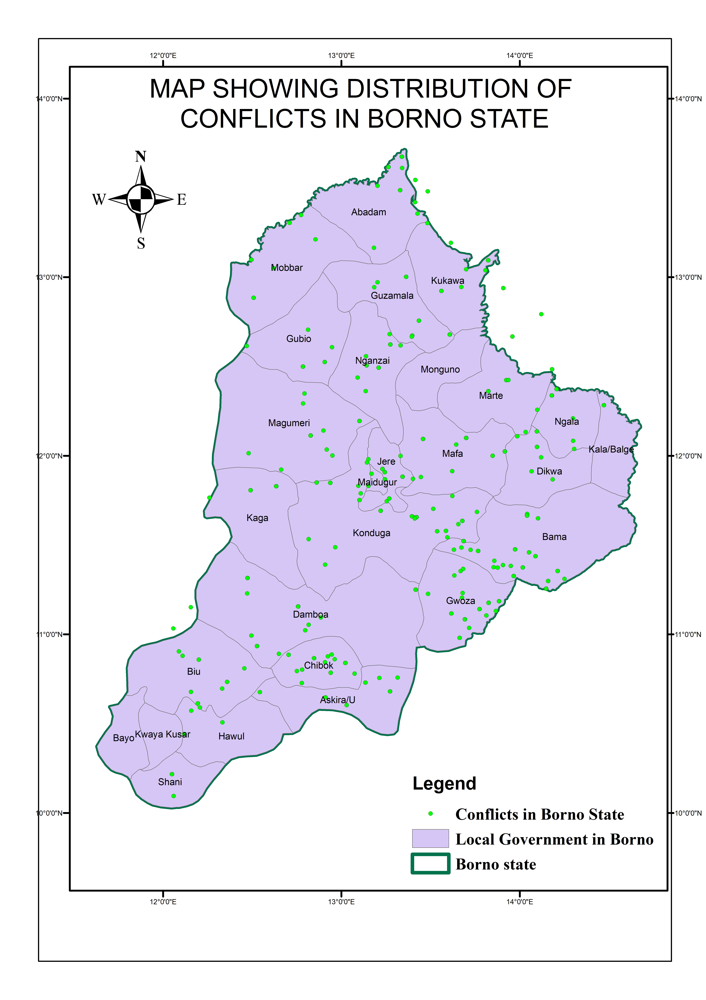
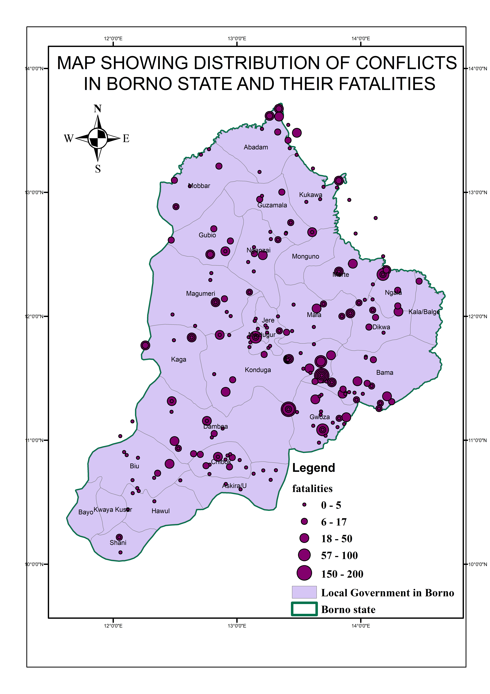
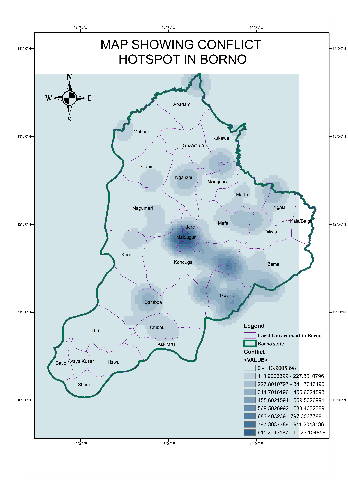
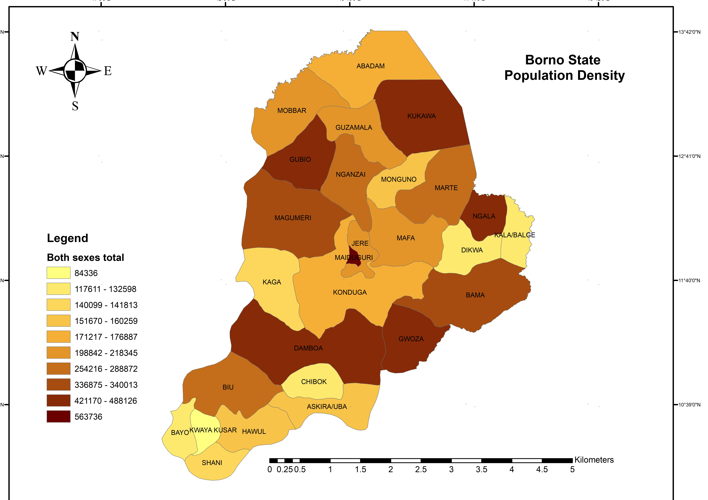
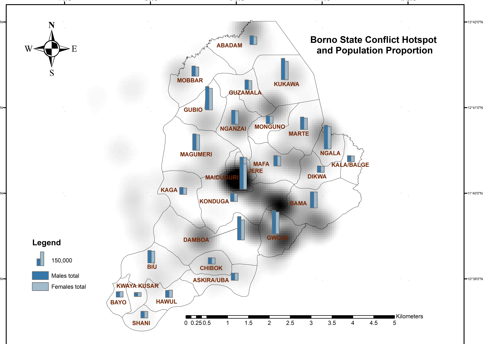
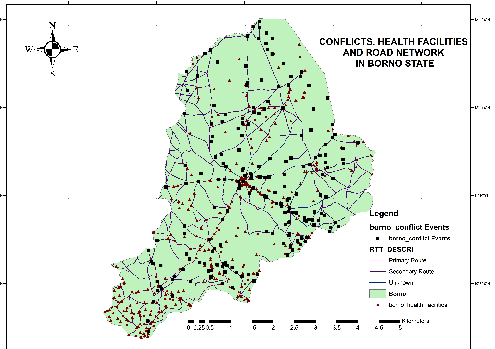
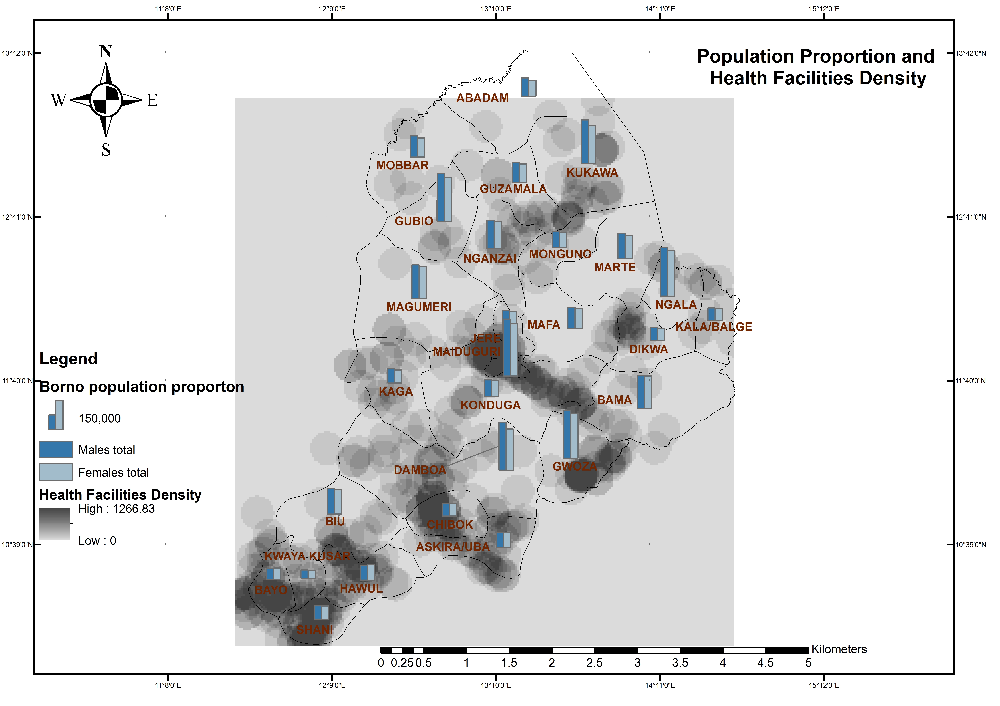

# Background
Borno State, one of Nigeria’s federating units, which prides itself as the “Home of Peace”, has been in the news 
since July 2009 for the wrong reasons. The typical headlines on and about the state are coordinated and 
uncoordinated bombings, sporadic gun battles, raiding of police stations, targeted killings, drive-by shootings, 
etc. All of these were unknown to the state and seemed distant until the 2009 insurgency mounted by the 
extremist Islamist sect, Jama’atu Ahis Sunna Lidda’awati Wal-Jihad, referred to in common parlance as Boko 
Haram
In the region of Borno, the health system has suffered significant deterioration due to ongoing conflict. Primary 
care services are inadequate, referrals are difficult to make, and hospitals are overwhelmed with patients. As a 
result, the local population has limited access to healthcare services.
The overall situation in Borno highlights the urgent need for comprehensive and improved healthcare 
intervention and optimized resource distribution.
I am pleased to present to you the report on the spatial analysis conducted to guide interventions aimed at 
improving access to healthcare services in Borno State. The analysis utilized various datasets, including conflict 
data, health facilities data, population density data, and administrative boundaries. The objective was to 
understand the distribution of facilities in high-risk areas, assess the risk profile of different population groups, 
and optimize resource allocation for healthcare intervention.
 
# Analysis and Findings

## 1. Distribution of Conflicts in the State
Looking at the analysis below we can see there more conflict at the center down to the east. This gives a picture 
of the local governments with the most conflict events in the state. 
 

## 2. Conflict Intensity Distribution
This represents the distribution of the conflicts in the state with their extremity. It gives a picture of areas with 
more violent conflict events. Health Facilities in areas like this are more prone to disruptions and destructions 
than others.

## 3. Hotspot of Borno Conflict  
Using the Kernel Density, this analysis identifies areas with a higher density and concentration of conflict events 
showcasing conflict hotspot locations in the state. LGs like Chibok, Maiduguri, gwoza, Jere, Nganzai would need 
more security resources than others.

## 4. Distribution of Health Facilities in the state 

## 5. Distribution of Health Facilities in Conflict Hotspots 

## 6. Population Density in Borno

## 7. Population Density and Health Facilities Distribution

## 8. Conflict Hotspot and Population Distribution

## 9. Conflict and Proximity to Health Facilities

## 10. Conflict and Road Network 

## 11. Density of Health Facilities in Relation to Population

# Summary
 - Conflict analysis revealed the spatial distribution of conflicts in Borno State. Hotspot analysis identified areas 
with a high concentration of conflicts, indicating potential high-risk zones.
 - Health facilities were mapped and overlaid with conflict areas to identify facilities located in or near high-risk 
areas.
 - The analysis highlighted facilities that may require additional security measures for effective service delivery.
 - Thematic maps were generated to visualize the population density across the region and identify areas with 
high concentrations of specific population groups.
 - By overlaying the population density maps with the conflict areas and health facilities, we were able to 
identify populations at higher risk due to inadequate access to healthcare.
Recommendations:
1. Resource Allocation and Service Delivery:
 - Prioritize resource allocation for healthcare intervention in high-risk areas identified through conflict analysis. 
Ensure adequate security measures are in place to support healthcare service delivery.
 - Strengthen the existing health facilities located in or near conflict zones to improve access and provide 
essential healthcare services to the affected population.
 - Consider establishing temporary or mobile healthcare facilities in areas with limited access to address the 
gaps in healthcare service coverage.
2. Targeted Healthcare Interventions:
 - Develop targeted interventions to address the specific healthcare needs of vulnerable population groups 
identified through the analysis.
 - Collaborate with local communities, healthcare providers, and relevant stakeholders to design and implement 
programs that address the unique challenges faced by each group.
 - Conduct awareness campaigns and education programs to promote health-seeking behaviors and preventive 
measures within the identified high-risk areas.

# Conclusion:
The spatial analysis conducted in Borno State provides valuable insights into the distribution of healthcare 
facilities in high-risk areas and the risk profile of different population groups. By integrating this information into 
decision-making processes, we can optimize resource allocation, improve service delivery, and enhance 
healthcare access for the population.
We recommend further research and ongoing monitoring of the healthcare situation in Borno State to adapt 
interventions and ensure their effectiveness over time. Additionally, collaboration with local communities and 
relevant stakeholders is essential for the successful implementation and sustainability of healthcare interventions

