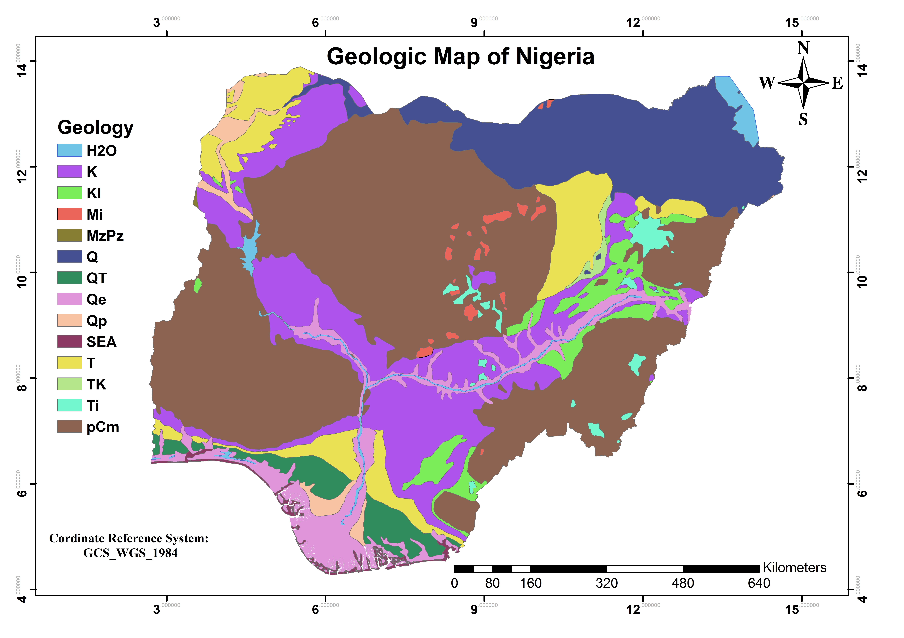

# Gis_Portfolio

## Introduction
Welcome to my GIS portfolio! This repository showcases my proficiency in Geographic Information Systems (GIS) using ArcGis and QGIS. I currently have two significant projects that demonstrate my skills and expertise in Geographic Information Systems (GIS). Each project demonstrates my skills in spatial analysis, data visualization, and problem-solving using GIS tools and techniques. Feel free to explore the details of each project and the codebase associated with them.  

## Project 1: Study Area Maps
Overview
The "Study Area Maps" project focuses on creating detailed and informative maps for specific study areas. These maps serve various purposes, including visualizing geographical features, analyzing land use patterns, and providing essential context for research and decision-making. The Maps were created using ArcGis and Qgis

Key Features
Thematic Layers: Incorporating thematic layers to highlight specific features relevant to the study, such as topography, infrastructure, and environmental factors.

Data Integration: Integrating diverse datasets to create comprehensive maps that offer a holistic view of the study area.

Cartographic Design: Employing effective cartographic design principles to ensure clarity, readability, and visual appeal.

Interactive Elements: Developing interactive maps to enhance user engagement and exploration of the study area.

### Examples of the Study Are Maps
### 1. Abuja Study Area Map
 

### 2. Geologic Map of Nigeria
 

### 3. Map of Bida
 

### 4. Map of Lapai Showing Change in Yield
 

## Project 2: Conflict Health Geoanalysis of Borno State
### Overview
The "Conflict Health Geoanalysis of Borno State" project delves into the intersection of conflict zones and public health in Borno State, Nigeria. Using GIS, this analysis aims to understand the spatial distribution of health facilities in conflict-affected areas, identify accessibility challenges, and propose informed solutions. The project aimed at addressing critical healthcare challenges in Borno State, Nigeria. The region faces multifaceted issues, including ongoing conflict impacting healthcare access.

### Key Features
- **Spatial Analysis:** Conducting spatial analysis to identify patterns and correlations between conflict zones and health facility distribution.

- **Accessibility Mapping:** Creating maps that visualize the accessibility of health facilities in conflict-affected areas, highlighting gaps and potential areas for improvement.

- **Impact Assessment:** Assessing the impact of conflict on public health infrastructure and identifying strategies to enhance healthcare services in challenging environments.

- **Data-driven Insights:** Utilizing data-driven insights to inform policy recommendations and interventions for improving healthcare delivery in conflict zones.

### Project Overview
- **Objective:** To enhance healthcare access by understanding the distribution of facilities in high-risk areas and assessing the risk profile of different population groups.
- **Datasets:** Integrated conflict data, health facilities locations, population density information, and administrative boundaries.
- **Tools:** Leveraged ArcGIS Desktop 10.5 for spatial analysis, hotspot analysis, proximity analysis, and visualization.

### Key Contributions
1. Conducted hotspot analysis to identify high-risk conflict zones, vital for mobilizing adequate security resources.
2. Utilized proximity analysis to assess the distribution of health facilities concerning high-risk areas, identifying gaps in healthcare coverage.
3. Analyzed population density for diverse age groups, aiding in understanding the risk profile of the population due to inadequate healthcare access.

### Results
- Generated thematic maps visualizing conflict intensity, health facility distribution, and population density.
- Unveiled insights into areas requiring urgent healthcare intervention and optimized resource distribution.

### Recommendations
- Proposed strategies for targeted security mobilization and expansion of healthcare facilities in high-risk and densely populated regions.
- Emphasized collaborative efforts between governmental and non-governmental organizations to address pressing healthcare needs.

### Conclusion
This project provided a holistic view of the healthcare landscape in Borno State, offering actionable insights for improving healthcare access in conflict-affected areas. The experience strengthened my skills in geospatial analysis, data interpretation, and project management.

### How to Explore
You can explore this project by viewing the report written for stakeholders containing the analysis and visualizations done. The project page provides a comprehensive overview, visualizations, and key insights gained through GIS analysis.

